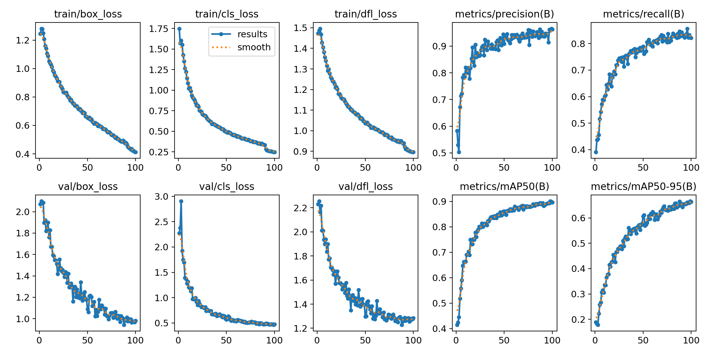
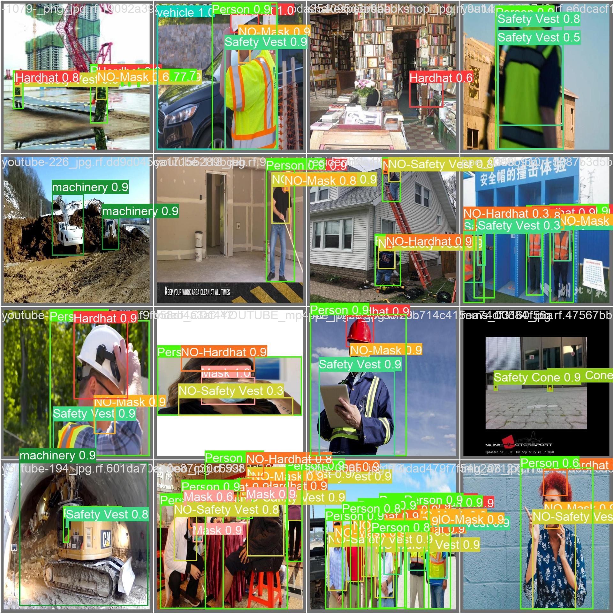
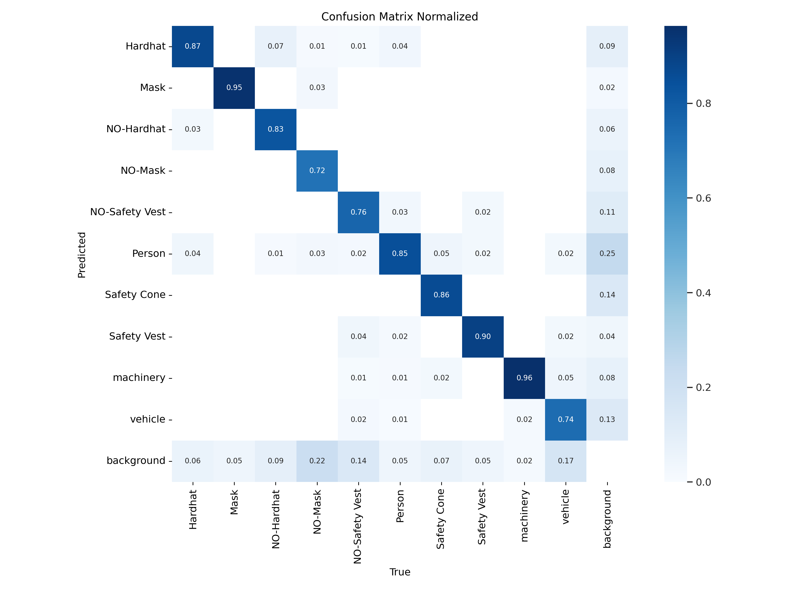

# 🚧 Einsatz von Deep Learning zur Gewährleistung der Arbeitssicherheit auf Baustellen

  

---
Über den folgenden Link können Sie Ihre Bilder oder Videos direkt hochladen und testen, sogar Live-Videos von Ihrer Kamera können getestet werden.

Through the link below, you can directly upload and test your images or videos, even test video streams from your camera.

## Link zur Sicherheitskleidungserkennung auf der Baustelle

https://miaoima.github.io/SafeBuildCheck/

---

# Projekt zur Sicherheitshelm-Erkennung

## Projektübersicht

In den Bereichen industrielle Produktion und Bauwesen ist die Sicherstellung der Sicherheit der Arbeitskräfte von entscheidender Bedeutung. Dieses Projekt zielt darauf ab, die automatische Erkennung von Sicherheitshelmen bei Arbeitnehmern auf der Baustelle mithilfe von Deep Learning-Technologien zu realisieren. Damit sollen Manager dabei unterstützt werden, Sicherheitsrisiken rechtzeitig zu erkennen und zu korrigieren und die Lebenssicherheit der Arbeiter vor Ort zu gewährleisten.

## Funktionale Merkmale

- **Mehrfach-Label-Erkennung:** Dieses Projekt kann genau erkennen und lokalisieren die folgenden Labels in Bildern oder Videos: ['Hardhat', 'Mask', 'NO-Hardhat', 'NO-Mask', 'NO-Safety Vest', 'Person', 'Safety Cone', 'Safety Vest', 'machinery', 'vehicle'], einschließlich, aber nicht beschränkt auf, ob Arbeiter Helme, Masken tragen, ob sie Sicherheitswesten tragen usw.

- **Echtzeiterkennung:** Verwenden Sie das Modell, um die Sicherheitsausrüstung, die während des Live-Videostreams getragen wird, in Echtzeit zu erkennen und sicherheitswidrige Verhaltensweisen rechtzeitig zu warnen.

- **Hohe Genauigkeit:** Durch den Einsatz von Deep Learning-Technologien kann unser Modell die Sicherheitsausrüstung von Arbeitnehmern unter verschiedenen Umgebungs- und Lichtbedingungen genau erkennen, Fehlalarme und Nichtmeldungen reduzieren.

## Technischer Rahmen

Dieses Projekt verwendet [Technologie oder Modellname] als Kerntechnologie für Bilderkennung und -analyse. Durch Training mit einer großen Menge an Daten aus realen Szenen kann das Modell präzise Sicherheitsausrüstungserkennung in komplexen Arbeitsumgebungen durchführen.

## Anwendungszenarien

- **Baustelle:** Überwachen Sie, ob Arbeiter Sicherheitshelme, Sicherheitswesten und andere Ausrüstungen ordnungsgemäß tragen.

- **Fabrikproduktionslinie:** Überprüfen Sie, ob Fabrikarbeiter Masken und andere notwendige Sicherheitsausrüstungen tragen.

- **Verkehrsüberwachung:** Analysieren Sie Fahrzeuge und Maschinenausrüstungen im Verkehrsfluss und bieten Sie Verkehrsinformationen an.

## Projektwert

- **Steigerung der Effizienz des Sicherheitsmanagements:** Automatisierte Erkennung von Sicherheitsausrüstung entlastet das Sicherheitspersonal und ermöglicht es ihnen, sich konzentrierter auf andere Sicherheitsprobleme zu konzentrieren.

- **Rechtzeitige Identifizierung von Sicherheitsrisiken:** Echtzeit-Videoüberwachung und -analyse können sicherheitswidrige Verhaltensweisen sofort erkennen und warnen, um Sicherheitsrisiken umgehend zu beseitigen.

- **Datenunterstützung:** Durch die Analyse einer großen Menge von Echtzeitdaten bietet es Unternehmen Entscheidungsunterstützung und eine Grundlage für kontinuierliche Verbesserungen.

---

## Dataset

Das untenstehende Bild gibt einen Überblick über den Trainingsdatensatz. Insgesamt sind die Quantität und Qualität der Daten recht hoch. 

  

## Result

Bei Betrachtung der Vorhersageergebnisse stellen wir fest, dass das Modell im Großen und Ganzen unseren Erwartungen entspricht. Allerdings glauben wir, dass bei mehr Trainingsepochen der Verlust (Loss) noch weiter reduziert werden könnte, da er derzeit noch einen abnehmenden Trend aufweist.

  

  

  

## Reference

- https://github.com/ultralytics/ultralytics
- https://github.com/Hyuto/yolov8-onnxruntime-web
